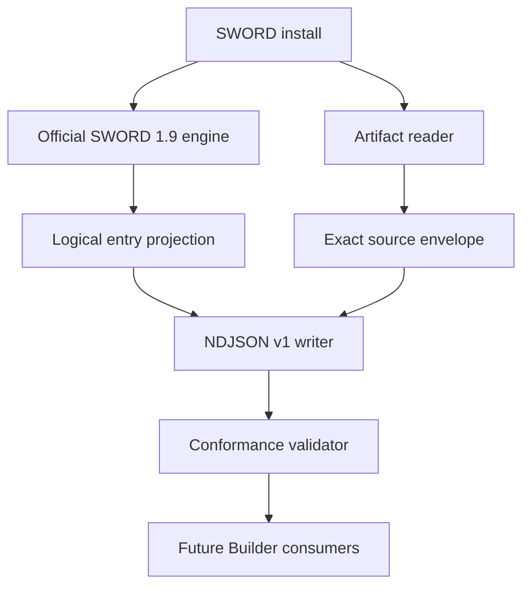

# Architecture

## Boundary

`getbiblesword` is an extraction engine and protocol producer. It has no Builder
model, database, template layer or HTTP API. Builder 3 and Study Builder consume
validated NDJSON later and must never depend on SWORD's in-process C++ types.

The SWORD engine owns module discovery, driver selection, key traversal, raw entry
decoding, rendering, stripping and entry-attribute interpretation. The artifact
reader independently preserves configuration, indexes, compressed data and media.
Neither side substitutes for the other.

## Components

| Component | Responsibility |
|---|---|
| `getbiblesword_core` | SHA-256, base64, byte envelopes, canonical JSON, NDJSON framing and raw annotation segmentation |
| `getbiblesword_sword` | SWORD discovery, classification, traversal, configuration projection and artifact capture |
| `getbiblesword` | Strict CLI, output lifecycle, exit codes and user-facing errors |
| `getbiblesword-v1` | Independent Python validator and atomic artifact reconstruction |
| `schema/v1` | Machine-readable contract boundary |
| `tests/corpus` | Public-domain all-driver conformance manifest and source fixtures |
| `tests` | Unit, negative, determinism, conformance and round-trip coverage |

## Determinism rules

- No timestamps, hostnames, locale output or unordered maps. SWORD-generated
  `PrefixPath` and `AbsoluteDataPath` configuration values are retained verbatim as
  official interpretations, so relocation to a different explicit root changes the
  stream by design.
- Module listing is sorted by module name bytes.
- Entry order is the official SWORD driver traversal order and carries an ordinal.
- Interpreted maps use SWORD's ordered map iteration; duplicate configuration keys
  remain duplicate records.
- Artifact paths use normalized root-relative byte paths and bytewise ordering.
- Binary values use base64 with SHA-256 and size; valid UTF-8 is only a convenience
  projection and is never authoritative.
- The footer hashes the exact UTF-8 bytes of all preceding NDJSON lines, including
  their LF terminators.
- A failed extraction still closes the stream with diagnostics and `success:false`
  whenever output framing has begun.

## Compatibility

The contract identifier is `getbiblesword.ndjson/v1`. Additive fields are allowed
within v1. A consumer must ignore unknown fields but must reject an unknown major
contract version. Removing a field, changing ordering semantics, changing digest
input or changing a field's meaning requires v2.
